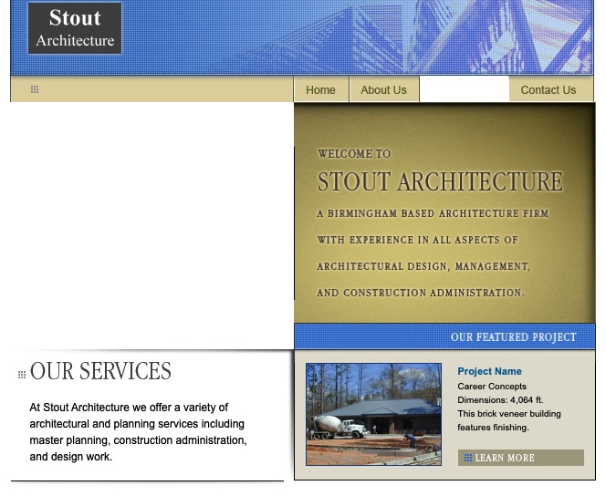
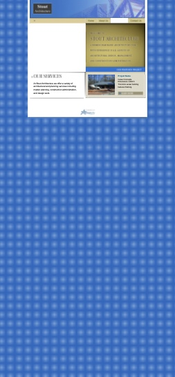
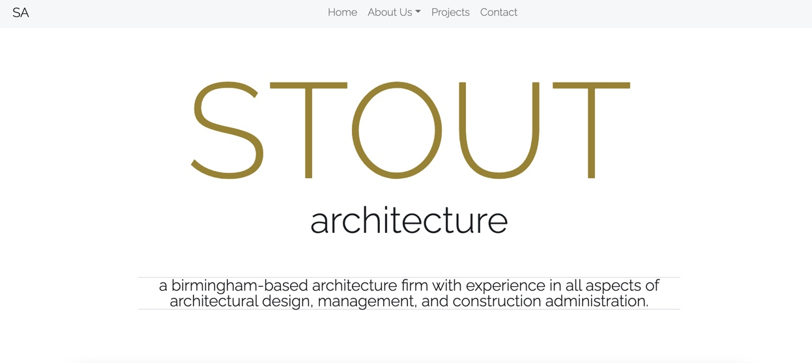
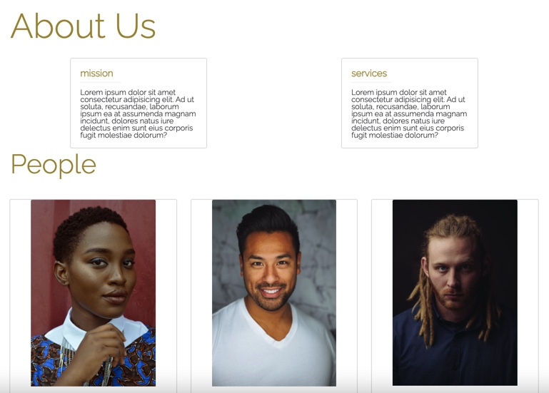
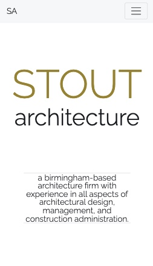

# Stout Architecture Website Redesign

## In Progress

<!-- [http://stoutarchitecture.com] -->

This is a website redesign for a small, architecture company.

## Project Management

The Waterfall Project Management Methodology was used to complete this project.

##### Start Date: 6/14/2021

##### Proposed Deployment Date: 6/30/2021

- [x] Requirement gathering and documentation: 6/14/2021
- [x] System design: 6/14/2021
- [ ] Implementation (including design and development): 6/14/2021 - 6/28/2021 (excluding weekends)
- [ ] Testing: 6/28-29/2021
- [ ] Delivery / Deployment: 6/30/2021
- [ ] Maintenance: ongoing

### To Do
- [ ] Complete People section of the About page
- [ ] Create Contact page
- [ ] Add [Parallax Scrolling](https://dixonandmoe.com/rellax) or [Smooth Scrolling](https://www.npmjs.com/package/react-scroll) (test to see which is better for this project)
- [ ] Perform testing

### Bug(s)

### Feature(s)

## Progress Photos

Here are before and after photos. The after photos aren't the final project.

### Before (Web)
<kbd></kbd>

### Before (Mobile)
<kbd></kbd>

### After (Web)
<kbd></kbd>

### After (Web)
<kbd></kbd>

### After (Mobile)
<kbd></kbd>

 
 

---

:octocat:&nbsp;&nbsp;Stout Architecture Website Redesign&nbsp;&nbsp;:octocat:  
:bowtie:&nbsp;&nbsp;A Gabe A. Production&nbsp;&nbsp;:bowtie:
